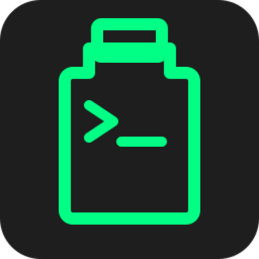

<p align="center">
  
</p>

<h1 align="center">Clipcopy</h1>

<p align="center">
  Tiny cross-platform CLI to manage clipboard history.<br/>
  Watch, search, and recall entries right from your terminal.
</p>

[](https://www.npmjs.com/package/clipcopy)
[](https://www.npmjs.com/package/clipcopy)
[](https://github.com/thegreatbey/clipcopy/actions/workflows/publish.yml)
[](https://bundlephobia.com/package/clipcopy)
[](https://packagephobia.com/result?p=clipcopy)
[](https://www.npmjs.com/package/clipcopy)
[](https://github.com/thegreatbey/clipcopy/blob/main/LICENSE)

## Install

```bash

npm i -g clipcopy


## Watch clipboard (Ctrl+C to stop)

clipcopy watch


## List the last 20 items

clipcopy list


## Search for a term

clipcopy search npm


## Copy item at index back to clipboard

clipcopy 2

## or

clipcopy copy 2


## Set history limit

clipcopy limit 100


## Clear history

clipcopy clear


